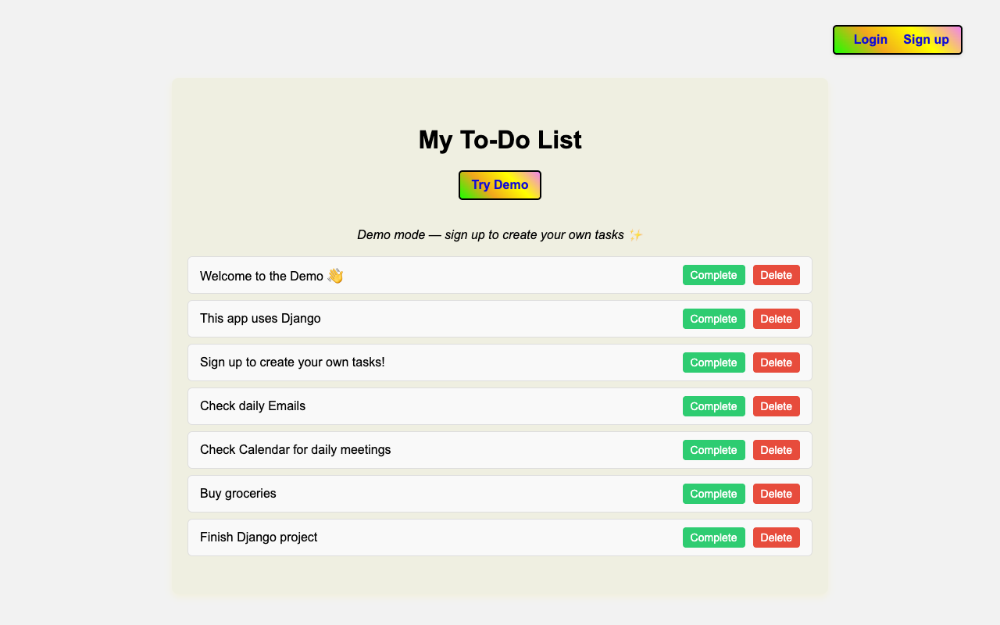
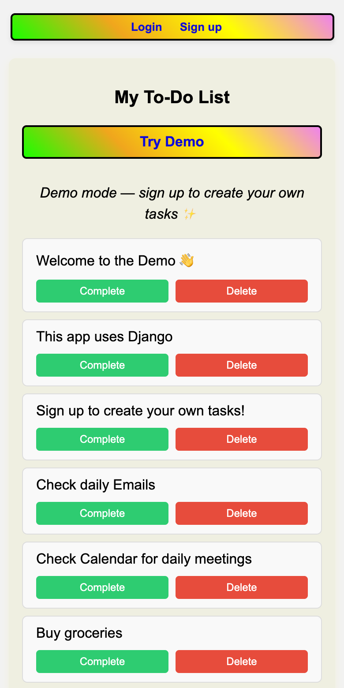

# Django To-Do App 📝

[](https://github.com/BitaYeganeh/Python_django-TO-DO-LIST-/actions/workflows/tests.yml)

A simple and interactive **To-Do List web application** built with Django. Users can sign up, log in, add tasks, mark them as complete, and delete them. A **public demo mode** allows visitors to try the app without creating an account.

**🌐 Live demo:** [django-todo-xvec.onrender.com](https://django-todo-xvec.onrender.com) · [Try the demo page](https://django-todo-xvec.onrender.com/demo/) *(free hosting: the first load can take up to a minute while the server wakes up)*



---

## Features

- **User Authentication**: Sign up, log in, and log out securely.
- **Task Management**:
  - Add tasks
  - Mark tasks as complete / undo
  - Delete tasks
- **User-Specific Tasks**: Each user sees only their own tasks.
- **Demo Mode**: Public demo tasks viewable without signing up.
- **Responsive UI**: Styled with CSS for a clean interface.

---

## Demo

- Open the [live demo page](https://django-todo-xvec.onrender.com/demo/) to try the app without an account, or run it locally (see below).
- Sign up to create and manage your own tasks.

<p align="center"></p>

---

## Testing

22 automated tests (Django `TestCase`) run on every push with GitHub Actions. The tests are in [`todo_project/tasks/tests.py`](todo_project/tasks/tests.py) and the workflow in [`.github/workflows/tests.yml`](.github/workflows/tests.yml).

| Area | What is checked |
| --- | --- |
| Model | Defaults, `__str__`, tasks removed with their user |
| Form | Title is required and limited to 200 characters |
| Sign-up | Creates and logs in the user; mismatched passwords are rejected |
| Tasks | Add, complete (toggle) and delete; empty titles are not saved |
| Security | Users only see and change their own tasks (others get 404); the demo account and visitors cannot edit |
| Demo mode | Visitors see demo tasks; the site still works when no demo user exists |

### Run it locally

```bash
python3 -m venv .venv              # Windows: py -m venv .venv
source .venv/bin/activate          # Windows: .venv\Scripts\activate
pip install -r requirements.txt
cd todo_project
python manage.py migrate
python manage.py seed_demo         # adds the demo user and demo tasks
python manage.py test tasks        # runs the 22 tests
python manage.py runserver
```

Then open http://127.0.0.1:8000/ (or http://127.0.0.1:8000/demo/ for the demo).
